# Module 2 Lecture: HTML Text, Lists & Structure

## Overview

In Module 1, you created your first webpage and learned the basics of HTML, browser previewing, Visual Studio Code, and GitHub. In Module 2, you will build on that foundation by expanding your webpage into something more organized and meaningful.

This module focuses on **HTML structure**, not design. You will practice organizing content using headings, paragraphs, lists, comments, indentation, and beginner-friendly GitHub workflows.

You are not expected to master everything right away. The goal is to build confidence and practice foundational skills one step at a time.

---

# From Hello Web to Structured Content

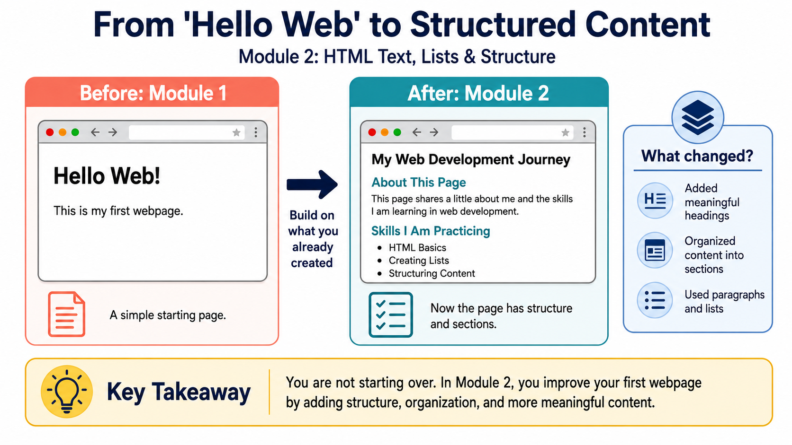

In Module 1, you created a simple webpage. That page may have only included a heading and a short paragraph—and that is okay.

In Module 2, you are not starting over.

Instead, you are building on what you already created by adding more structure and meaning to your webpage.

Think of learning web development like building with LEGO bricks. You start with a foundation and add pieces one at a time.

This module helps you move from a simple “Hello Web” page to a more organized webpage using headings, paragraphs, lists, comments, and cleaner structure.

---

# Building on Your First Webpage

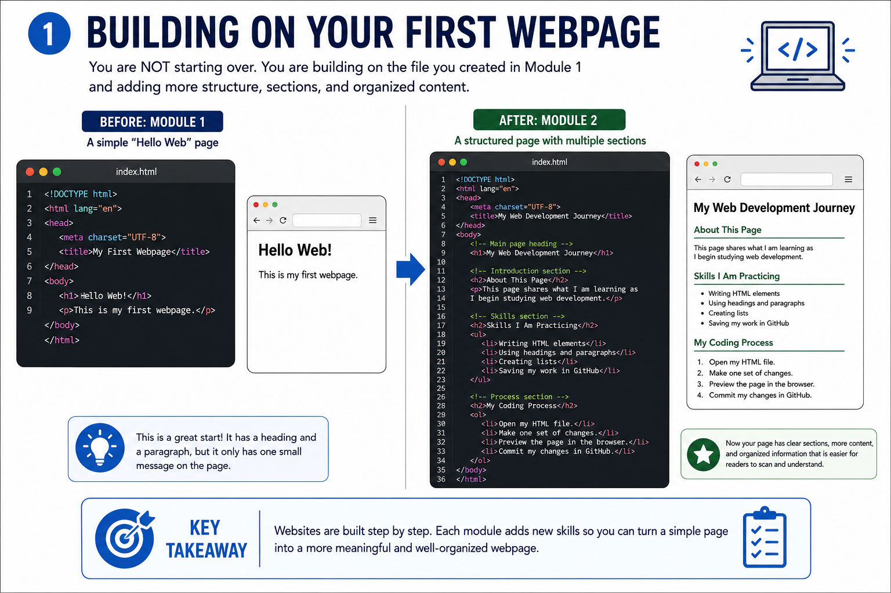

Your Module 1 webpage may have looked something like this:

```html
<h1>Hello Web!</h1>
<p>This is my first webpage.</p>
```

That is a great starting point.

In Module 2, you will expand your webpage by adding sections, more content, and organization.

Instead of a simple page, you may begin creating sections such as:

- About Me
- Why I Am Learning Web Development
- Skills I Want to Learn
- My Goals for This Course

Real websites are improved over time. Developers regularly revisit projects to update, revise, and improve them.

That is exactly what you are beginning to practice.

---

# Understanding HTML Elements

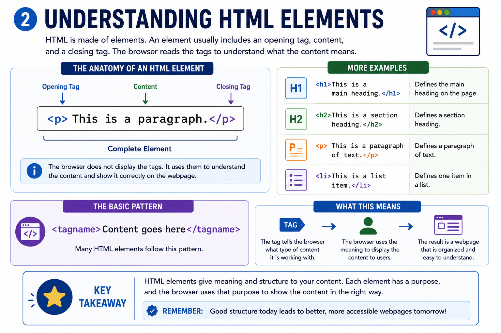

HTML is made of **elements**.

Most HTML elements follow this pattern:

```html
<element>Content goes here</element>
```

For example:

```html
<p>This is a paragraph.</p>
```

Many HTML elements include:

- An opening tag
- Content
- A closing tag

The browser reads the tags to understand the purpose of content.

For example:

- `<h1>` tells the browser this is a main heading
- `<p>` tells the browser this is paragraph text

HTML helps define meaning and structure.

---

# Headings: Creating an Outline for the Page

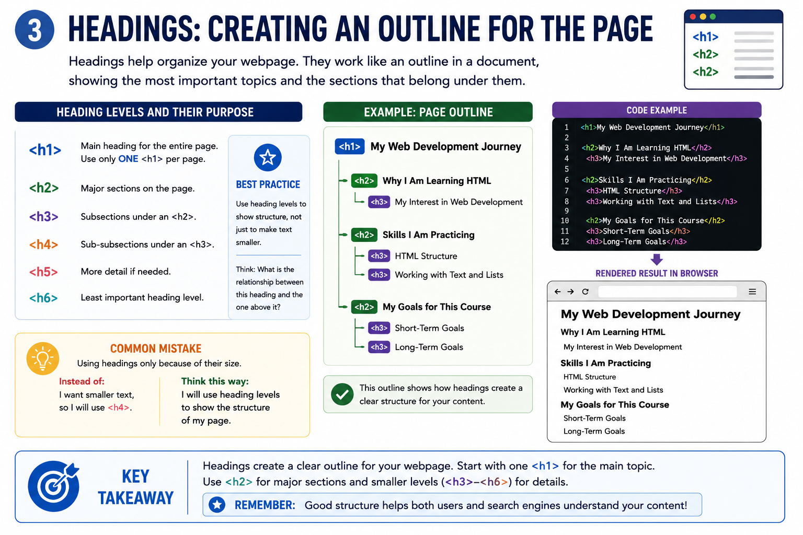

Headings organize a webpage like an outline.

Example:

```html
<h1>My Web Development Journey</h1>

<h2>Why I Am Learning HTML</h2>

<h2>Skills I Want to Learn</h2>
```

Best practices:

- Use **one `<h1>`** for the main page topic
- Use `<h2>` for major sections

Remember:

Choose headings based on **structure**, not appearance.

Later, CSS will control size and design.

---

# Paragraphs: Adding Details to Each Section

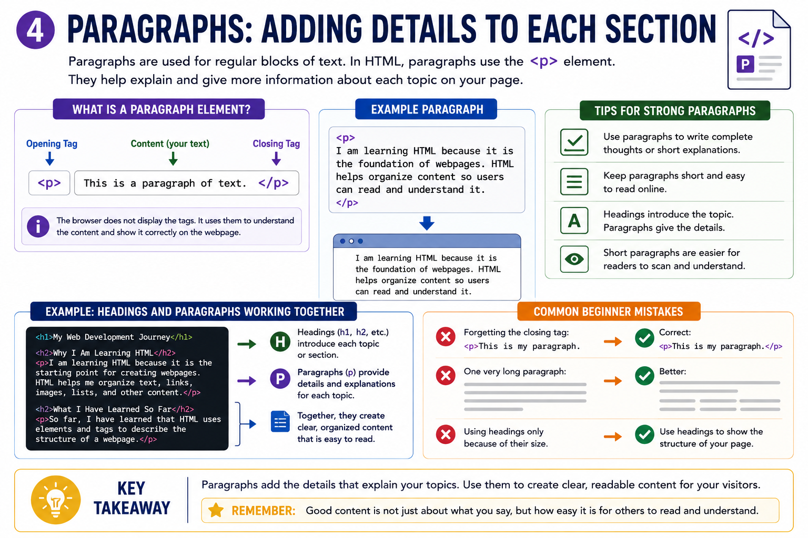

Paragraphs explain ideas and provide details.

Example:

```html
<p>
    I am learning web development because I want to
    understand how websites are created.
</p>
```

A good webpage uses:

- Headings to organize content
- Paragraphs to explain ideas

Try to avoid one large wall of text.

Short, readable sections improve usability.

---

# Lists: Organizing Related Information

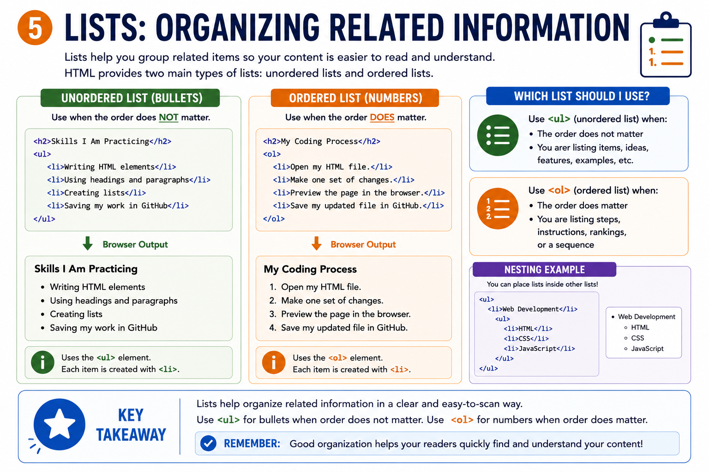

Lists help organize information.

### Unordered List (`<ul>`)

Use when order does **not** matter.

Example:

```html
<ul>
    <li>HTML</li>
    <li>CSS</li>
    <li>JavaScript</li>
</ul>
```

### Ordered List (`<ol>`)

Use when sequence **does** matter.

Example:

```html
<ol>
    <li>Open VS Code</li>
    <li>Edit my webpage</li>
    <li>Preview my webpage</li>
</ol>
```

Lists make webpages easier to read and scan.

---

# Nesting and Indentation

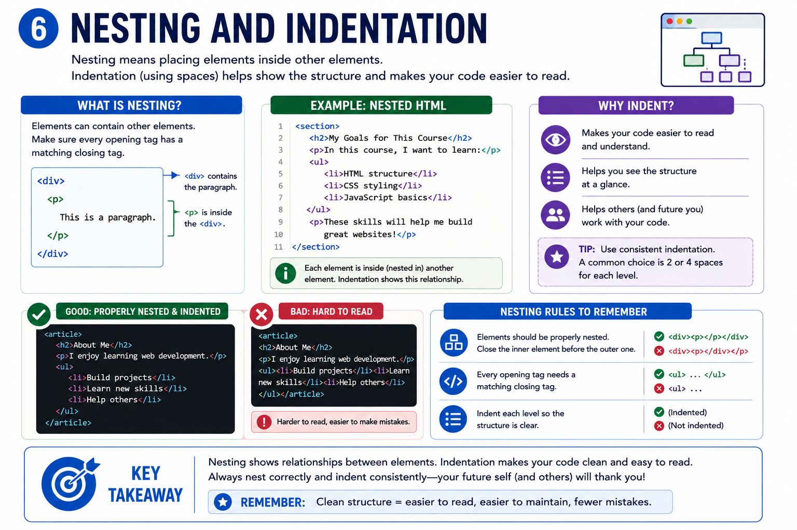

**Nesting** means placing elements inside other elements.

For example:

```html
<ul>
    <li>HTML</li>
    <li>CSS</li>
</ul>
```

The `<li>` elements belong inside the `<ul>`.

**Indentation** makes code easier to read.

Good example:

```html
<ul>
    <li>HTML</li>
    <li>CSS</li>
</ul>
```

Messy example:

```html
<ul><li>HTML</li><li>CSS</li></ul>
```

Clean code helps you troubleshoot and stay organized.

---

# HTML Comments: Notes Inside Your Code

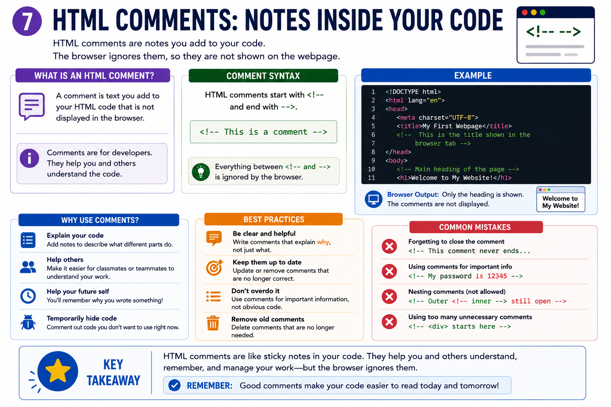

Comments are notes written inside your code.

Example:

```html
<!-- Skills section -->
```

Comments:

- Help organize code
- Explain sections
- Do **not** appear on the webpage

Good example:

```html
<!-- About Me section -->
<h2>About Me</h2>
```

You do not need to comment every line.

Instead, label major sections.

---

# Putting the Pieces Together

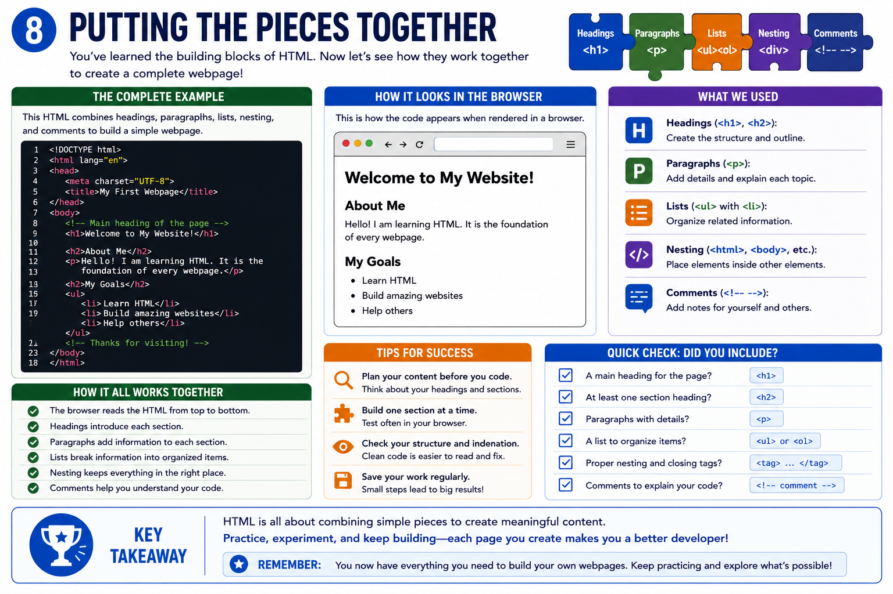

Now you can combine multiple HTML skills into one organized webpage.

Example structure:

```html
<h1>My Web Development Journey</h1>

<h2>About Me</h2>
<p>Information about me...</p>

<h2>Skills I Want to Learn</h2>
<ul>
    <li>HTML</li>
    <li>CSS</li>
</ul>

<h2>My Coding Process</h2>
<ol>
    <li>Open VS Code</li>
    <li>Edit my file</li>
</ol>
```

At this point, you are beginning to think about structure and organization instead of just individual tags.

---

# VS Code, GitHub, and Commits: Understanding the Difference

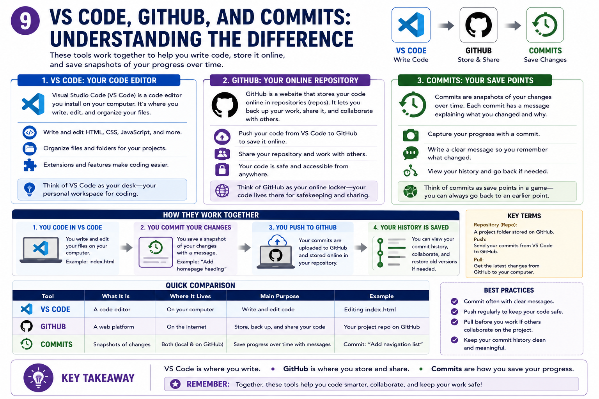

You are using multiple tools in this course.

### VS Code

Where you **write and edit code**

### Browser

Where you **preview your webpage**

### GitHub

Where you **save and track project changes**

Remember:

Saving in VS Code does **not** automatically update GitHub.

At this stage:

1. Edit in VS Code  
2. Save the file  
3. Preview in browser  
4. Update GitHub

---

# How to Update Your File in GitHub Without the Command Line

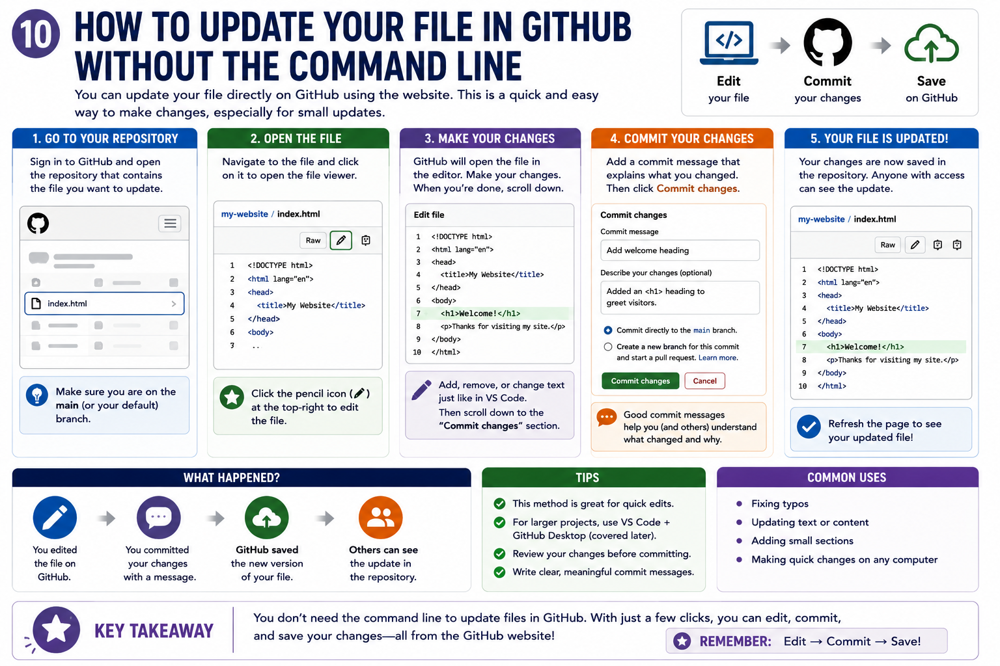

You are **not expected to use the command line** yet.

Instead:

1. Edit your file in VS Code
2. Save your work
3. Preview in the browser
4. Open your GitHub repository
5. Update your HTML file
6. Add a meaningful commit message

Example commit message:

```text
Expand webpage with headings, lists, and comments
```

GitHub helps track changes over time.

---

# Previewing and Checking Your Work

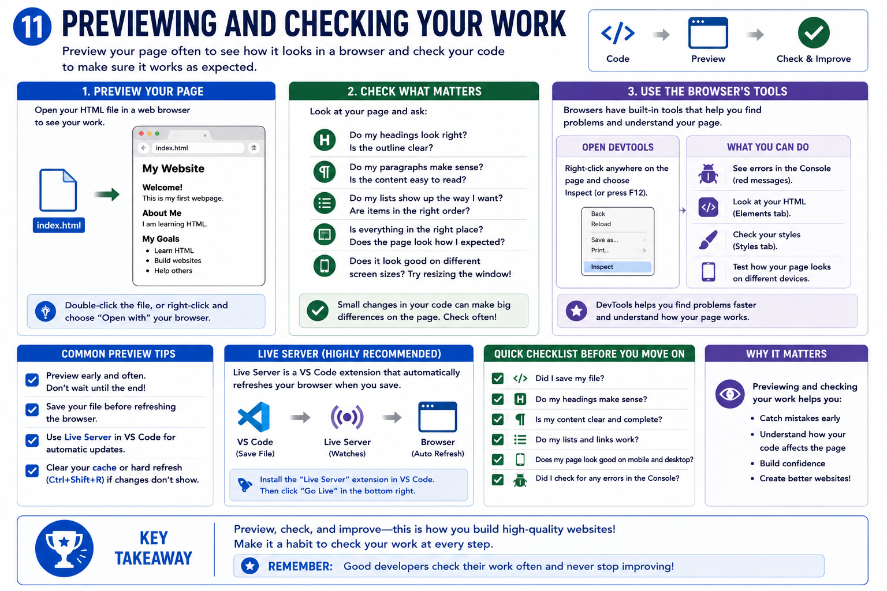

Always preview your webpage before submitting.

Ask yourself:

- Does the page open correctly?
- Are headings readable?
- Do lists display correctly?
- Are comments included in the code?
- Is the indentation clean?

Developers constantly:

**Write → Preview → Revise → Save**

Build that habit early.

---

# Common Beginner Mistakes to Watch For

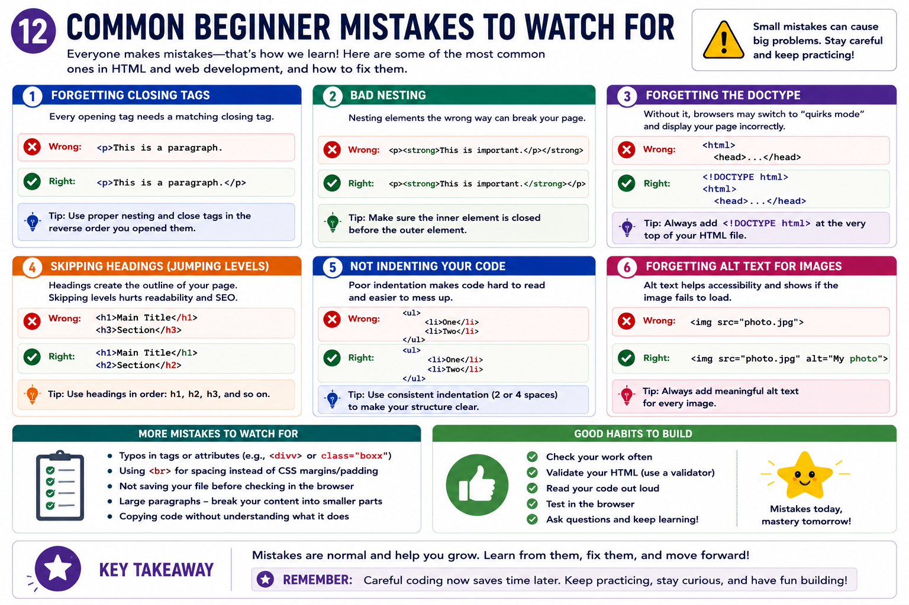

Some common beginner mistakes include:

### Forgetting Closing Tags

Incorrect:

```html
<p>This is my paragraph.
```

Correct:

```html
<p>This is my paragraph.</p>
```

### Forgetting List Containers

Incorrect:

```html
<li>HTML</li>
<li>CSS</li>
```

Correct:

```html
<ul>
    <li>HTML</li>
    <li>CSS</li>
</ul>
```

### Using Headings Based on Size

Incorrect thinking:

> “I want smaller text so I will use H4.”

Better thinking:

> “I want to organize this section, so I will use H2.”

### Forgetting to Preview

Always check your work in the browser.

### Confusing VS Code and GitHub

Remember:

**VS Code = edit**

**Browser = preview**

**GitHub = save and track changes**

---

## References

GitHub. (n.d.). *About commits*. GitHub Docs. https://docs.github.com/en/pull-requests/committing-changes-to-your-project/creating-and-editing-commits/about-commits

GitHub. (n.d.). *Editing files*. GitHub Docs. https://docs.github.com/en/repositories/working-with-files/managing-files/editing-files

GitHub. (n.d.). *Using the activity view to see changes to a repository*. GitHub Docs. https://docs.github.com/en/repositories/viewing-activity-and-data-for-your-repository/using-the-activity-view-to-see-changes-to-a-repository

GitHub. (n.d.). *Viewing and understanding files*. GitHub Docs. https://docs.github.com/en/repositories/working-with-files/using-files/viewing-and-understanding-files

MDN Web Docs. (n.d.). *Basic HTML syntax*. Mozilla. https://developer.mozilla.org/en-US/docs/Learn_web_development/Core/Structuring_content/Basic_HTML_syntax

MDN Web Docs. (n.d.). *Headings and paragraphs*. Mozilla. https://developer.mozilla.org/en-US/docs/Learn_web_development/Core/Structuring_content/Headings_and_paragraphs

MDN Web Docs. (n.d.). *Lists*. Mozilla. https://developer.mozilla.org/en-US/docs/Learn_web_development/Core/Structuring_content/Lists

## Attribution & License

This lecture was created by **Jennifer Lee** for **WEB 110: Web Development Fundamentals**. Original instructional content and visuals are licensed under a **Creative Commons Attribution 4.0 International License (CC BY 4.0)**, unless otherwise noted.

Suggested attribution:  
Lee, J. (2026). *WEB 110 Module 2: HTML Structure*. Licensed under CC BY 4.0.

https://creativecommons.org/licenses/by/4.0/
